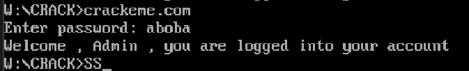

# **Взлом кода**

## **1. Задание**
### Общая информация
Задание выполнялось в парах, каждый написал программу на ассемблере, предназначенную для взлома напарником, и кряк на Си, осуществляющий взлом.

### Программа для взлома
Я написал программу на языке ассемблера, производящую аутентификацию пользователя через пароль. Программа имеет две уязвимости разного уровня сложности для взлома через ввод пользователя (без использования сторонних программ).  

### Кряк
Я написал программу на Си, которая изменяет исполняемый файл напарника таким образом, чтобы он выдавал отчёт об успешном вводе пароля при любом вводимом пароле. Кряк имеет графический интерфейс, анимации и музыку, соответствующие уважающему себя кряку.

## 2. Мои уязвимости
### Простая уязвимость

Проверка пароля осуществляется так: определяется его хеш-кода и сравнивается с хеш-кодом, который соответствует правильному паролю. Конец ввода пароля пользователь должен помечать символом ARGS_END_ASCII = '\$', и расчёт хеш-кода ведется вплоть до его встречи. 
```
;-------------------------------------------------------
; Gets hash code of the specified string
; Entry:    ds:di = string terminating on ENTER_ASCII
; Exit:     ax    = hash code
; Destr:    bx, di
;-------------------------------------------------------
GetPswdHash     proc
        mov ax, 5381d   ; start val of hash
    
    next_char_to_hash:
        
        ; hash = hash * 32 + ds:[di++]
        mov bx, 32
        mul bx
        
        mov bl, byte ptr ds:[di]
        add ax, bx
        inc di

        cmp bx, ARGS_END_ASCII
        jne next_char_to_hash

        ret
        endp
;-------------------------------------------------------
```
    
Уязвимость заключается в расположении буфера для пароля и значения хеш-кода верного пароля:
```
PSWD_BUFFER         db PSWD_MAX_LEN dup(0)
CORRECT_PSWD_HASH   dw 4524h   ; hash of 'ARS LOH'
```
То есть если PSWD_MAX_LEN = 10, то такой пароль программа посчитает правильным:


Числа после '\$' не будут влиять на хеш, а последовательность байт `A0C4`, затирающая значение верного хеш-кода, соответствует хеш-коду пустого пароля (начинающегося с '$').

### Сложная уязвимость
Расположение буфера в конце сегмента данных позволяет ввести пароль такой длины, чтобы можно было дойти до конца сегмента и затереть стек, в частности, адрес возврата, который там лежит. Функция считывания пароля должна возвращаться к месту вызова, за которым следует функция нахождения хеша и затем сравнение его с верным.
```
24    ; get pswd
25        lea di, PSWD_BUFFER
26        call GetPswdToBuffer
27
28        call GetPswdHash        ; ax = hash
29        cmp ax, CORRECT_PSWD_HASH
30        
31        jne incorrect_pswd
32        lea dx, CORRECT_PSWD_STR
33        mov ah, 09h
34        int 21h
35        jmp exit
36
37    incorrect_pswd:
38        lea dx, INCORRECT_PSWD_STR
39        mov ah, 09h
40        int 21h
41
42    exit:
43        mov ax, 4c00h
44        int 21h
```

Однако переполнив буфер, мы можем изменить адрес возврата на такой, чтобы по выходе из функции GetPswdToBuffer происходил джамп на 32 строку (её адрес - 0x0118). Для создания такого пароля я написал программу на Си, которая создаёт файл и генерирует в него пароль, который после будет направлен в программу для взлома. Используя turbodebugger, можно определить точные адреса начала буфера, 32 строки и адреса возврата из функции GetPswdToBuffer: 

Снимок был сделан сразу после вызова функции GetPswdToBuffer.


Таким образом, направив получившийся файл программе для взлома на вход, получаем:


## 3. Выполнение задания: поиск уязвимостей в программе напарника
### Простая уязвимость
Дизассемблировав код через IDA и проанализировав его, было обнаружено, что количество байт, выделенное в буфере для пароля (14h байт) не соответствовало тому, которое было записано в начало буфера для 21 прерывания (0Ah байт):


Кроме того, сам буфер находится внутри кода: перед ним стоит обходной джамп, перепрыгивающий на байты сразу после буфера. То есть можно переполнить буфер, заменив следующую за вызовом прерывания команду на джамп на часть кода, отвечающую за правильный пароль. 


### Сложная уязвимость
Для взлома в этом случае используем специальную программу - кряк. Она изменяет исходный код таким образом, чтобы программа для взлома исполняла тот код, который нам требуется. Программа представляет из себя графическое приложение. При запуске появляется dvd-рамка, оставляющая за собой след градиента. После нажатия на неё открывается диалоговое окно, спрашивающее, крякнуть указанную программу или выйти.
|||
|---------------------------|------------------------------|

Для её написания определим, в каком месте эта программа определяет верность введенного пароля. Введенный пароль сверяется с верным в этой части кода:


Изменив команду jnz (номер 0x75) на jmp (номер 0xEB), получим, что любой пароль подойдёт:



Изменение исполняемого файла производится этой частью кода кряка:

```
const char *const COM_FILE_NAME = "CRACKEME.com";

const size_t COMMAND_ADDR = 0x76;
const char   NEW_COMMAND  = 0xEB;   // jmp
```
```
void CrackProg()
{
    FILE *com_file = fopen(COM_FILE_NAME, "rb+");

    fseek(com_file, COMMAND_ADDR, SEEK_SET);
    fwrite(&NEW_COMMAND, 1, 1, com_file);

    return;
}
```

После работы кряка получаем взломанную программу, пройти аутентификацию в которой можно используя любой пароль.